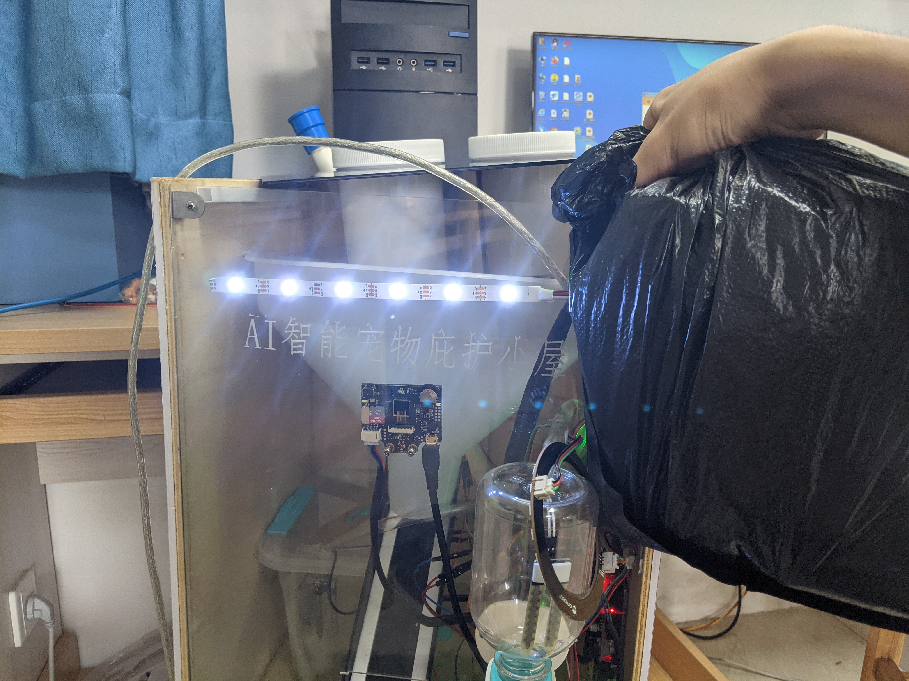
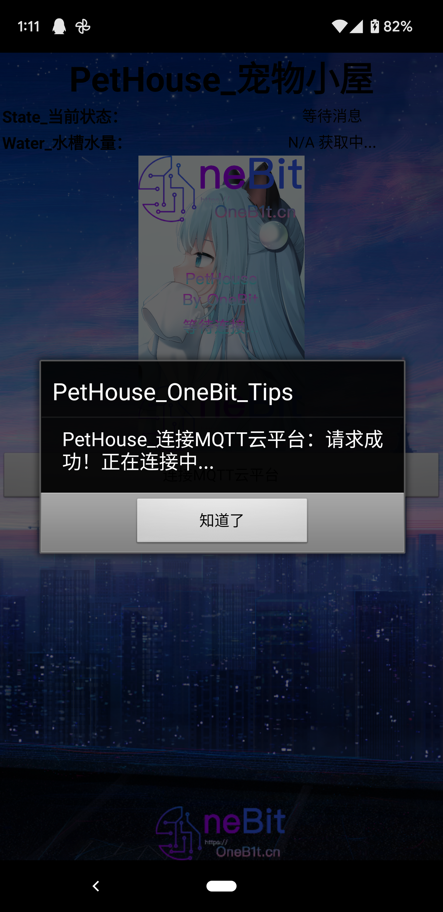
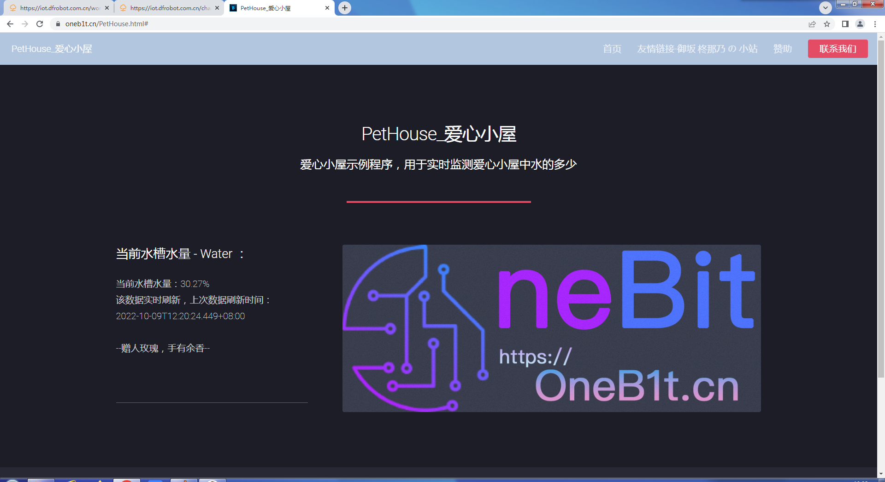
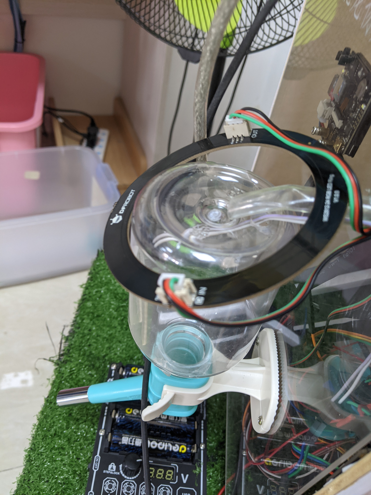
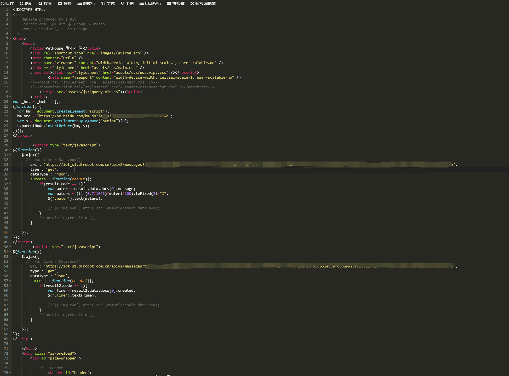

# PetHouse

<a target="_blank" href="https://github.com/Sh1n3zZ/PetHouse"></a> 
<a target="_blank" href="https://github.com/Sh1n3zZ/PetHouse"></a>
<a target="_blank" href="https://github.com/Sh1n3zZ/PetHouse">
[](https://github.com/sponsors/Sh1n3zZ)

<div align="center" width="100%">
    
</div>

This is a pet rescue project based on Mind+ is called PetHouse.



## ⭐ Previews

### APP / WebSite
<p align="center">


</p>

### Appearance / WebCodes
<p align="center">


</p>

## ⭐ Features

* You can adjust the drawing speed, record the numbers that pass and fail.
* Easy language is used for programming (a Chinese programming language similar to Visual Basic), which is easy to use and change content.
* The window is rounded to increase the ornamental value.

## 🔧 How to Use

### 💪🏻 Windows

- [Download Release](https://github.com/Sh1n3zZ/PetHouse/releases) and run it.

### 🐳 Linux

- [Download Release](https://github.com/Sh1n3zZ/PetHouse/releases) .
- [Download Wine](https://www.winehq.org/) and run it through Wine.

```bash
#Install the latest Wine
wget -qO- https://raw.githubusercontent.com/wszqkzqk/deepin-wine-ubuntu/master/online_install.sh | bash -e

#Run it in Wine
env WINEPREFIX=~/.wine2 wine This software.exe
```
## 🆙 How to Update

Please come here and install the latest release.

## 🆕 What's Next?

Better UI & Less BUG.

---I am a line---

That's all tkx for read~!
Have a good day!
If you love this project, please consider giving me a ⭐.
